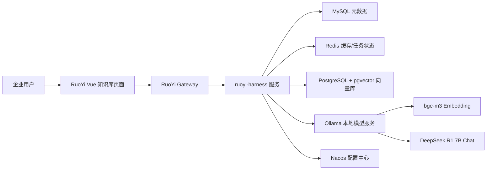
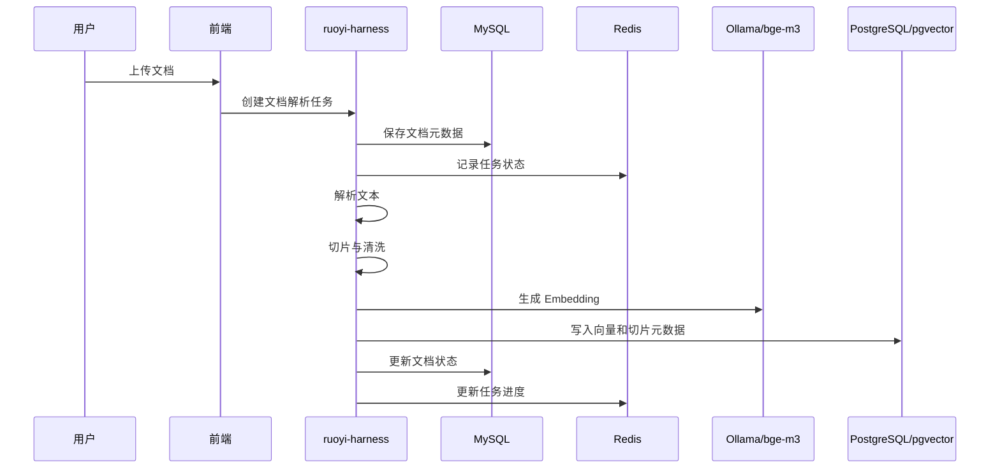
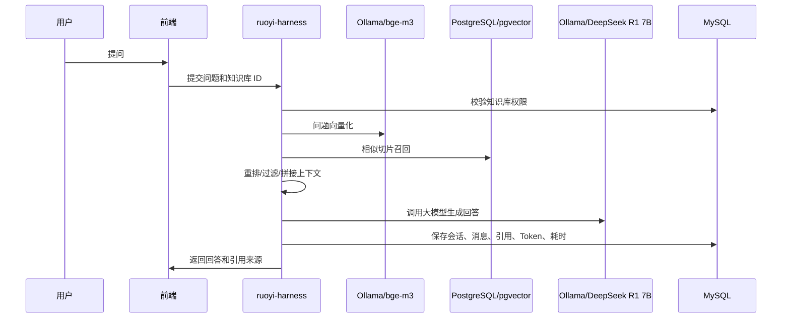

# 企业知识库问答架构设计

## 关联需求

- `docs/requirements/REQ-20260609-002-enterprise-knowledge-base-qa.md`

## 目标

基于当前 RuoYi Cloud 项目，搭建企业知识库问答功能的首版架构。首版重点是可运行、可审计、可扩展、可逐步生产化，而不是一次性做完整知识管理平台。

## 已知环境

- 注册与配置中心：Nacos。
- 关系型数据库：MySQL。
- 缓存与临时状态：Redis。
- 向量数据库：PostgreSQL，已启用 `pgvector`。
- 本地大模型：DeepSeek R1 7B，由 Ollama 部署。
- 本地向量模型：bge-m3，由 Ollama 部署。
- Java AI 框架：Spring AI Alibaba。
- 基础工程：RuoYi Cloud。

## 推荐模块边界

### 后端模块

```text
ruoyi-modules/ruoyi-harness
```

职责：

- 知识库管理。
- 文档管理。
- 文档解析任务。
- 文档切片。
- Embedding 生成。
- 向量入库。
- 问答检索。
- Prompt 组装。
- 模型调用。
- 会话与消息日志。
- 引用来源返回。
- Token、耗时、失败原因统计。

### 远程 API 模块

```text
ruoyi-api/ruoyi-api-harness
```

职责：

- 对其他服务暴露知识库、问答、模型调用日志的远程 API 契约。
- 首版如果没有跨服务调用，可以先只规划，不急于实现。

### 前端目录

```text
ruoyi-ui/src/api/harness
ruoyi-ui/src/views/harness
```

推荐页面：

- 知识库列表。
- 知识库详情。
- 文档上传与解析状态。
- 知识库问答页面。
- 会话历史。
- 模型调用日志。

## 总体架构



## 核心流程

### 文档入库流程



### 问答流程



## 分层设计

```text
controller
  KnowledgeBaseController
  DocumentController
  ChatController
  ModelLogController

service
  KnowledgeBaseService
  DocumentService
  DocumentIngestService
  ChunkingService
  EmbeddingService
  VectorStoreService
  RetrievalService
  PromptRenderService
  ChatCompletionService
  ConversationService
  AiCallLogService

mapper
  MySQL Mapper：知识库、文档、任务、会话、消息、日志
  PostgreSQL Mapper/Repository：向量切片检索

domain
  entity / dto / vo / query
```

## 数据存储设计

### MySQL

保存业务元数据、状态、权限关联和审计日志。

推荐表：

- `harness_kb`：知识库。
- `harness_kb_acl`：知识库访问控制。
- `harness_document`：文档元数据。
- `harness_document_task`：文档解析和向量化任务。
- `harness_conversation`：会话。
- `harness_message`：消息。
- `harness_message_citation`：回答引用来源。
- `harness_ai_call_log`：模型调用日志。
- `harness_prompt_template`：Prompt 模板。
- `harness_model_config`：模型配置。

### PostgreSQL + pgvector

保存切片文本、向量和检索字段。当前 PostgreSQL 已确认启用 `pgvector`。

推荐表：

- `harness_kb_chunk_vector`

推荐字段：

- `id`
- `kb_id`
- `document_id`
- `chunk_id`
- `chunk_index`
- `content`
- `content_hash`
- `metadata`
- `embedding vector`
- `enabled`
- `create_time`

向量维度必须以 Ollama 中 bge-m3 实际 embedding 响应长度为准，不能在未验证前写死。

### Redis

用于：

- 文档解析任务进度。
- 问答短期上下文缓存。
- 防重复提交。
- 限流计数。
- 临时召回结果缓存。

Redis 不保存必须长期追溯的数据。

## 模型服务接入

### Ollama

DeepSeek R1 7B 和 bge-m3 均已确认由 Ollama 部署。

建议在后端封装统一模型适配层：

- Chat：调用 Ollama 中的 DeepSeek R1 7B。
- Embedding：调用 Ollama 中的 bge-m3。
- 对上层 Service 屏蔽 Ollama 原生 API 或 OpenAI-compatible API 差异。
- 如果 Spring AI Alibaba 当前接入方式支持 Ollama，优先使用框架适配；否则在 `ruoyi-harness` 内封装轻量适配器。

### DeepSeek R1 7B

通过 Ollama 调用本地 Chat 模型。

需要配置：

- base url。
- model name。
- timeout。
- max tokens。
- temperature。
- top p。
- 是否流式输出。

### bge-m3

通过 Ollama 调用本地 Embedding 模型。

需要配置：

- base url。
- model name。
- embedding dimension。
- batch size。
- timeout。

首版必须提供 Ollama 模型健康检查，至少检查 Chat 模型和 Embedding 模型是否可用，避免文档入库或问答时模型不可用但界面一直等待。

## Nacos 配置建议

配置项不写真实密钥，只定义 key。

```yaml
harness:
  ai:
    chat:
      provider: ollama
      base-url: ${HARNESS_OLLAMA_BASE_URL}
      model: deepseek-r1:7b
      timeout-seconds: 120
      stream-enabled: true
    embedding:
      provider: ollama
      base-url: ${HARNESS_OLLAMA_BASE_URL}
      model: bge-m3
      dimension: ${HARNESS_EMBEDDING_DIMENSION}
      batch-size: 16
      timeout-seconds: 60
  rag:
    top-k: 8
    min-score: 0.35
    max-context-chars: 12000
    chunk-size: 800
    chunk-overlap: 120
```

## API 规划

首版 API：

- `GET /harness/kb/list`：知识库列表。
- `POST /harness/kb`：创建知识库。
- `PUT /harness/kb`：更新知识库。
- `DELETE /harness/kb/{id}`：删除或停用知识库。
- `POST /harness/document/upload`：上传文档。
- `POST /harness/document/{id}/ingest`：触发解析和向量化。
- `GET /harness/document/list`：文档列表。
- `GET /harness/document/task/{id}`：查询任务状态。
- `POST /harness/chat`：普通问答。
- `POST /harness/chat/stream`：流式问答。
- `GET /harness/conversation/list`：会话列表。
- `GET /harness/conversation/{id}`：会话详情。
- `GET /harness/ai-log/list`：模型调用日志。

所有管理接口必须接入 RuoYi 权限注解和操作日志。

## 权限设计

推荐权限粒度：

- `harness:kb:list`
- `harness:kb:add`
- `harness:kb:edit`
- `harness:kb:remove`
- `harness:document:list`
- `harness:document:upload`
- `harness:document:ingest`
- `harness:chat:ask`
- `harness:conversation:list`
- `harness:log:list`

知识库需要支持拥有者、部门、角色或用户级访问控制。首版可以先做角色或用户授权，不直接改 RuoYi 全局安全模块。

## 生产关键约束

- 用户问题必须限制长度。
- 文档上传必须限制类型、大小和数量。
- 文档解析失败必须可重试。
- 向量化失败不能导致文档元数据丢失。
- 模型调用必须记录耗时、Token、模型名、失败原因。
- 回答必须返回引用来源，降低幻觉不可追溯风险。
- Prompt 模板必须版本化。
- 模型服务不可用时必须快速失败或返回明确错误。
- 不能让模型输出直接执行删库、改权限、发通知等高风险动作。

## 首版里程碑

### M1：环境和基础模块

- 新建 `ruoyi-harness` 业务模块规划。
- 接入 MySQL、Redis、PostgreSQL 向量库配置。
- 定义 Nacos 配置项。
- 提供模型健康检查设计。

### M2：知识库和文档入库

- 知识库 CRUD。
- 文档上传。
- 文档解析状态。
- 文档切片。
- bge-m3 向量化。
- PostgreSQL 向量写入。

### M3：RAG 问答

- 问题向量化。
- 向量召回。
- Prompt 拼接。
- DeepSeek R1 7B 调用。
- 返回回答和引用来源。
- 保存会话、消息和调用日志。

### M4：生产化补强

- 权限授权。
- 操作日志。
- 限流。
- 失败重试。
- 单元测试和集成验证。
- AI 问答评测集。

## 后续实现建议

1. 先通过 Ollama 健康检查确认 DeepSeek R1 7B 和 bge-m3 模型名、接口协议和可用性。
2. 通过一次 bge-m3 embedding 调用确认向量维度，再确定 PostgreSQL pgvector 字段维度。
3. 先实现 MySQL 元数据表和 PostgreSQL 向量表 SQL 迁移。
4. 再实现后端服务骨架。
5. 最后接前端页面和流式问答体验。
